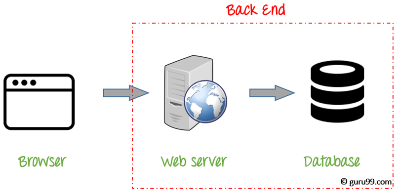
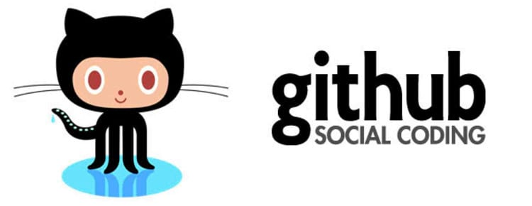
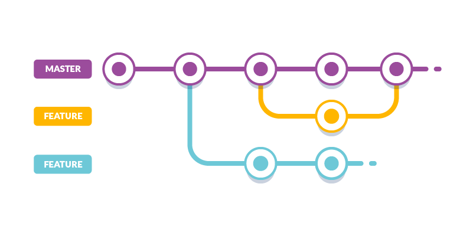

# Conceitos gerais

# Front-end


Podemos classificar como a parte visual de um site, aquilo que conseguimos interagir. Quem trabalha com Front End é responsável por desenvolver por meio de código uma interface gráfica, normalmente com as tecnologias base da Web (HTML, CSS e JavaScript).

O designer vai desenhar a tela, com Photoshop ou algum software do tipo, e a pessoa front-end vai aplicar atraves de código (HTML, CSS e JavaScript) o desenho da tela que o designer fez, além disso no front-end também tem muita lógica de programação, componentes que precisam guardar estados e responder a eles de maneiras diferentes.

O mundo do front-end possui diversas tecnologias, frameworks e bibliotecas. E está sempre evoluindo.

# Mobile


Desenvolvimentos de applicativos.

As tecnologias que envolvem os aplicativos mobile são inicialmente diferentes das que citamos para a Web sendo elas para android: Java, Kotlin; E para iOS: Swift e Objective C.

O que pode gerar uma intersecção do Front End e do mundo Mobile é React Native por utilizar tanto um framework super popular na Web quanto a linguagem JavaScript. Mesmo com essa familiaridade toda, as diferençås das plataformas separam os profissionais que mexem com sites e aplicativos em duas linhas diferentes.


# Back-end



Back End, como o próprio nome sugere, vem da ideia do que tem por trás de uma aplicação. Pode ficar meio abstrato em um primeiro momento, mas pense que para conseguir usar o Facebook no dia a dia, os dados do seu perfil, amigos e publicações precisam estar salvos em algum lugar, sendo esse lugar um banco de dados.

O Back End trabalha em boa partes dos casos fazendo a ponte entre os dados que vem do navegador (front-end) rumo ao banco de dados e vice-versa, sempre aplicando as devidas regras de negócio, validações e garantias em um ambiente onde o usuário final não tenha acesso e possa manipular algo.

Tudo isso pode ser feito com uma série de linguagens diferentes como: Python, PHP, Ruby, Java, Kotlin, Clojure, C#, JavaScript (Node.js) entre diversas outras.


# Banco de Dados


O banco de dados é a organização e armazenagem de informações sobre um domínio específico. De forma mais simples, é o agrupamento de dados que tratam do mesmo assunto, e que precisam ser armazenados para segurança ou conferência futura.

# O fluxo:


# O que é o git?


Git é um __sistema de controle de versões__ , usado principalmente no desenvolvimento de software.
 O Git é um software livre, foi inicialmente projetado e desenvolvido por Linus Torvalds para o desenvolvimento do kernel Linux.


# O que é o GitHub?



GitHub é uma plataforma de hospedagem de código-fonte com controle de versão usando o Git. Ele permite que programadores ou qualquer usuário cadastrado na plataforma contribuam em projetos privados e/ou Open Source de qualquer lugar do mundo.


## Linha de comando


### Comandos mais usados:
* ls - list (lista todos os arquivos presentes no diretório MAC/LINUX)
* dir - list(Windows)
* dir /b - mostra lista de maneira simplificada
* pwd - Present working directory (MAC/LINUX)
* cd - change directory
* cd ~ - volta para a raiz
* cd .. - volta uma pasta
* cd nome-da-pasta - para entrar em uma pasta
* code . - abre o visual studio code na pasta local.
* mkdir nome-da-pasta - para criar uma pasta
* touch nome-do-arquivo - para criar um arquivo
* rm nome-do-arquivo - para remover um arquivo
* history - mostra histórico de comandos (LINUX/MAC)
* f7 - history no Windows


## Instalação do Git

O git já vem instalado na maioria dos computadores Mac e Linux, se for o seu, apenas digite na linha de comando: git --version
Caso esteja instalado, esse comando mostrará a versão do git.

tutorial: https://woliveiras.com.br/posts/instalando-o-git-windows/

* git para mac: https://git-scm.com/download/mac
* git para windows: https://gitforwindows.org/
* git para plataformas Linux/Debian, como o Ubuntu: digite na linha de comando ````sudo apt-get install git ````


### Git configuração

Para adicionar usuário:

```
git config --global user.name "natalyapeixoto"
git config --global user.email “natalya_peixoto@hotmail.com”
```

Para remover usuário:

```
git config --global --unset user.name "natalyapeixoto"
git config --global --unset user.email “natalya_peixoto@hotmail.com”
```

## Criar conta e perfil no GitHub

[link GitHub](https://github.com/)

Lembre-se que o github é onde as empresas vão ver seu trabalho.
Então mantenha tudo organizado e use bom senso na hora de escolher seu nome de usuário.


## Subindo projeto local para o GitHub

* Criar novo repositório no seu github e dar nome a ele.
* no sua máquina, pela linha de comando, vá até a pasta do projeto.
* dentro da pasta do projeto rode o comando: ````git init```` (pasta git oculta é criada)
* ````git add .```` para adicionar todos os arquivos que estão na sua pasta de uma vez, caso queria adicionar apenas um digite ````git add caminho-do-arquivo````
* ````git commit -m"mensagem para explicar o que voce fez no código"````
* ````git remote add origin url-que-voces-copiaram-do-github````
* ````git remote -v```` mostra as url que o git está apontando
* ````git push origin master````


__git status__ Esse comando nos ajuda a ver os estágios dos arquivos.
Antes do add e do commit podemos usá-lo para ver quais arquivos foram criados e ou modificados.

#### Files stages (Estágios do arquivo)
* *untracked files* nao deu instrução ao git do que fazer com or arquivo
* *changes to be committed* adicionou, mas não deu o commit
* *commited*  commit foi feito


## Git Clone

serve para baixar, na sua máquina, um projeto que está hospedado no github.

* Acesse o repositório do projeto que quer baixar
* clicar no botão ```` clone or download ````
* copiar url
* Na sua máquina abra a linha de comando e vá até a pasta onde deseja colocar o projeto
* rode o comando: ```` git clone url-do-repositorio ````

## Branch

Branch significa, galho, ramificação.
Usando branches podemos trabalhar paralelamente nos projetos sem alterar a versão principal(master).



* ````git checkout -b nome-da-branch```` cria uma nova branch e entra nela
* ```` git branch ```` mostra as branchs que existem no projeto/repositório, destacando a branch atual
* ````git checkout nome-da-branch```` para mudar de branch


#### git pull

como diz o nome, para __puxar__ atualizações de uma branch remota para a branch atual(local).
```` git pull origin master```` atualiza a branch que você está trabalhando com a master.


## Pull request (a famosa PR)

Na Pull request, você está simplesmente solicitando ao responsável(ou responsáveis) do repositório aprovação para que as alterações que você fez sejam integradas a branch principal (normalmente a branch master).
Na pull request, precisamos escrever o que fizemos.
Cabe ao responsável aceitar, negar, pedir correções, fazer um code review da sua solicitação e etc.


# Contribuindo num projeto remoto

- clonar repositório (``git clone url-do-projeto``)
- caso já tenha o projeto na sua máquina, precisamos atualizar a branch master local
(``git pull origin master``)
- criar sua branch para trabalhar (``git checkout -b nome-da-sua-branch``)
- finalizado o trabalho vamos subir nossas mudanças:
    - ``git add .``
    - ``git commit -m "o que eu fiz"``
    - ``git push origin nome-da-sua-branch``
- agora vamos no github abrir a PR

## Readme.md MARKDOWN

Arquivo essencial para todo repositório no github.
onde explicamos o projeto e damos algumas instruções, caso necessário.

* https://dillinger.io/
* https://guides.github.com/pdfs/ markdown-cheatsheet-online.pdf


# links úteis:

* https://medium.com/reprogramabr/git-e-github-por-onde-come%C3%A7ar-ca88a783c223 -> Medium Reprograma. Escrito por Thaylla <3

* https://git-scm.com/book/pt-br/v1/Primeiros-passos-Sobre-Controle-de-Vers%C3%A3o -> Documentação oficial do git em português.

* https://rogerdudler.github.io/git-guide/index.pt_BR.html -> git - guia prático
