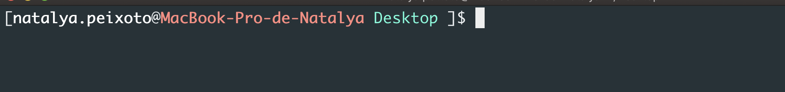

# Exercício da Semana

Crie um novo repositório no seu github com o nome que preferir.
  - No seu github clique em `Repositories`
  - No canto direito da página vai aparecer o botão verde `New`, clique nele.
  - Escreva o nome desejado do repositório no campo `Repository name`
  - Por fim clique em `Create repository`

Crie no seu computador uma pasta com o mesmo nome do repositório:
 - A partir da area de trabalho (Desktop) do seu computador abra o git bash
 - Ao abri-lo certifique-se de que está na pasta correta (Desktop)
 
 - agora vamos criar a nossa nova pasta com o comando: `mkdir nome-da-pasta`
 - Depois vamos acessar a pasta com: `cd nome-da-pasta`
 - E estando dentro da nossa nova pasta vamos fazer os comandos abaixo:

* `echo "# Meu Exercício" >> README.md`
* `git init`
* `git add README.md`
* `git commit -m "first commit"`
* `git remote add origin url-do-seu-repositorio`
* `git push -u origin master`

Escolha um entre os 3 temas abaixo.

- HTML e CSS
- Frameworks e bibliotecas
- Como funciona a internet

Faça uma pesquisa sobre o seu tema escolhido.

Crie uma nova branch:
  - ``git checkout -b nome-da-sua-branch``
  - Coloque sua pesquisa no arquivo README.md
      o Readme é arquivo que termina com `.md` ou sejá ele é um arquivo Markdown.
      Markdown é uma sintaxe usada para padronizar e facilitar formatação de texto na web, utilizada em aplicativos como Slack e GitHub
      links par ajudar a editar arquivos markdown.
        - https://dillinger.io/
        - https://guides.github.com/pdfs/markdown-cheatsheet-online.pdf

  - finalizado o trabalho vamos subir nossas mudanças:
      - ``git add .``
      - ``git commit -m "o que eu fiz"``
      - ``git push origin nome-da-sua-branch``

Agora vamos no github abrir a PR:
  - quando você der o primeiro `push` no proprio terminal (git bash) a url da pull request vai aparecer
  - pode copia-la e abri-la em seu navegador.
  - Basta adicionar uma breve descrição e clicar no botão `Create pull request`
  - Após criar o PR, copie o link e coloque no google classroom.

Caso a PR já esteja aberta e você deu um novo push:
  - não precisa abrir a PR novamente, ela será atualizada com o novo código automaticamente.
